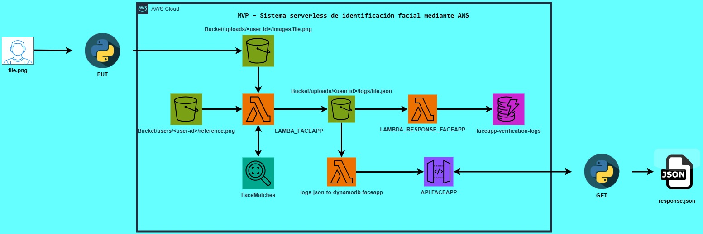

# 🤖 MVP – Sistema serverless de identificación facial mediante AWS 🧑‍💻

## Resumen 📋

📌 Análisis de Fraude en Tarjetas de Crédito: Datos, Detección y Decisiones

Cada año, el fraude con tarjetas de crédito le cuesta miles de millones al sistema financiero. Los bancos y empresas buscan frenar estas pérdidas, pero hay un reto enorme: ¿cómo detectar el fraude sin afectar la experiencia de los clientes?

Los falsos positivos—cuando una transacción legítima es bloqueada por error—pueden frustrar a los usuarios y generar desconfianza en el sistema. Por eso, contar con métodos precisos y eficientes es clave para encontrar el equilibrio entre seguridad y usabilidad.

🎯 ¿Qué haremos en este proyecto?

En este MVP construiremos un sistema de identificación facial usando una arquitectura completamente serverless sobre AWS. A través de un flujo automatizado, una imagen es enviada desde un cliente (por ahora, vía script Python), almacenada en Amazon S3, procesada por AWS Lambda, y analizada por Amazon Rekognition, que compara el rostro recibido con los registros previamente almacenados. Los resultados de esta verificación son guardados en Amazon DynamoDB para su trazabilidad y consulta.

Este sistema simula cómo se puede validar la identidad de un usuario de forma automatizada, segura y escalable.

🔍 ¿Por qué es importante este proyecto?

La verificación de identidad basada en biometría es una tecnología clave en sectores como seguridad, acceso físico/digital, control de asistencia, autenticación en apps y mucho más. Al aprovechar servicios serverless de AWS:

- Eliminamos la necesidad de administrar servidores.

- Garantizamos escalabilidad y eficiencia en costos.

- Validamos una solución que puede escalar fácilmente hacia entornos reales o comerciales.

Este MVP demuestra cómo se puede aplicar inteligencia artificial en la nube para resolver problemas cotidianos de manera robusta y moderna.

💡 Al final, el objetivo es simple: validar la identidad de las personas de forma automática, sin complicar la experiencia del usuario.

## Arquitectura 💡

La solución desarrollada esta implementada entre Python y AWS.

  

## Tecnologías Implementadas 💻

- AWS
- Python(version 3.13)
- POSTMAN

## Usuario 👤

En este proyecto, el sistema recibe una imagen enviada por el usuario, junto con su identificador único (user_id). A partir de esto:

###### 1. Busca la imagen de referencia del usuario en S3 (almacenada previamente con su user_id).

###### 2. Compara la nueva imagen con la referencia utilizando Amazon Rekognition.

###### 3. Evalúa el nivel de similitud y determina si la persona en la imagen es quien dice ser.

###### 4. Registra el resultado (éxito o fallo en la identificación) en DynamoDB.

###### 5. Devuelve una respuesta de validación, indicando si la identidad fue confirmada o no.

## Servicios utilizados en AWS ⛓️‍💥

- S3: Permite almacenar los registros(imagenes) que se capturan por cada usuario y el resultado(json) de la validación que se lleva a cabo.
- Lambda: Permite llevar a cabo el almacenamiento y validación de los usuarios.
- IAM: Permite la interacción e integración entre los distintos servicios, manteniendo la politica de otorgar la minima correspondencia.
- Amazon Rekognition: Mediante el algoritmo de "FaceMatches" valida si el usuario corresponde al que se tiene registrado.
- DynamoDB: Permite almacenar los registros que se realizaron(exitosos y no exitosos) en el proceso de validación.
- API Gateway: Permite obtener el resultado de la solicitud enviada, en la cual se indica si el usuario ha sido reconocido de manera exitosa o no.

## Configuraciones de los servicios en AWS ⚙️

- [Creación Bucket S3 README](./docs/Create_Bucket_S3.md)
- [LAMBDA ALMACENAMIENTO EN S3 Y VALIDACIÓN DE IDENTIDAD  README](./docs/Lambda_SaveAndValidation_UserID.md)
- [LAMBDA ENVIO DE RESPUESTA A API GATEWAY README](./docs/Send_Response_to_ApiGateway.md)
- [LAMBDA ALMACENAMIENTO DE LOGS EN DYNAMODB README](./docs/Send_Logs_to_DynamoDB.md)
- [CREACIÓN E INTEGRACIÓN DESDE API GATEWAY README](./docs/ApiGateway_to_HTTP.md)
- [CREACIÓN DE TABLA EN DYNAMODB README](./docs/Create_Table_DynamoDB.md)

## Integración entre Python y AWS CLOUD 🤝

- Para integrar AWS Cloud con Python de manera manual, aprovechamos la flexibilidad de AWS Lambda, Rekognition y S3. Desde Python, enviamos imágenes directamente a la nube y activamos funciones Lambda que procesan y comparan rostros usando Rekognition, todo sin necesidad de servidores. Almacenar los resultados en DynamoDB permite tener un registro seguro y escalable. Esta integración permite un flujo de trabajo automático y eficiente, donde Python actúa como el controlador sin servidor, haciendo todo el proceso más ágil y flexible.  

Nota: Los archivos "Send_Image_to_S3.py" y "Get_Response_of_ApiGateway.py", permiten cargar la imagen al usuario y consultar el resultado de la petición procesada.

## Consideraciones futuras 🔧

- Interfaz de usuario (IU): Desarrollar una interfaz gráfica para facilitar la carga de imágenes y eliminar la necesidad de hacer peticiones manuales.

- Automatización: Optimizar el proceso de carga de imágenes a S3 y validación mediante API Gateway para hacerlo completamente automático.

- Mejora en la precisión: Ajustar el sistema de reconocimiento facial para mejorar la exactitud y la velocidad de las comparaciones.

- Escalabilidad: Preparar el sistema para manejar un mayor volumen de usuarios sin comprometer el rendimiento, implementando soluciones como Auto Scaling.

- Notificaciones: Añadir un sistema de notificaciones para informar a los usuarios sobre el resultado de su validación, ya sea por correo electrónico o SMS.

- Flujo de trabajo actual: El proceso se ejecuta a demanda del usuario, aprovechando los servicios gratuitos de AWS. Sin embargo, la frecuencia de ejecución debe revisarse para evitar posibles costos fuera de la capa gratuita.

## Licencia ☑️

Copyright 2025 Keiver Reinaldo Rincon Pabon

## Author 🙆‍♂️

- [@keiver31](https://www.github.com/keiver31)

